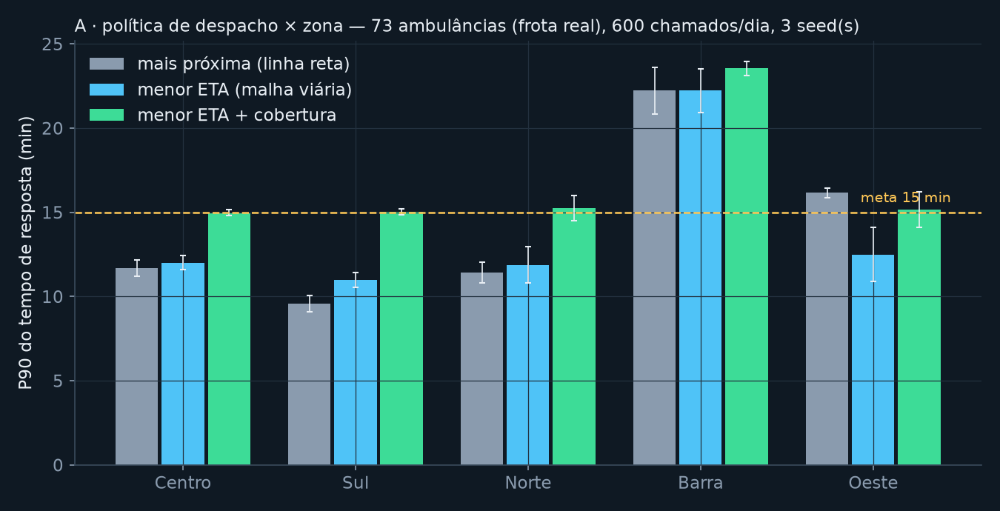
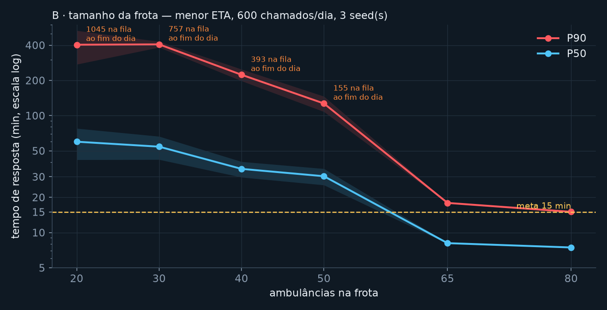
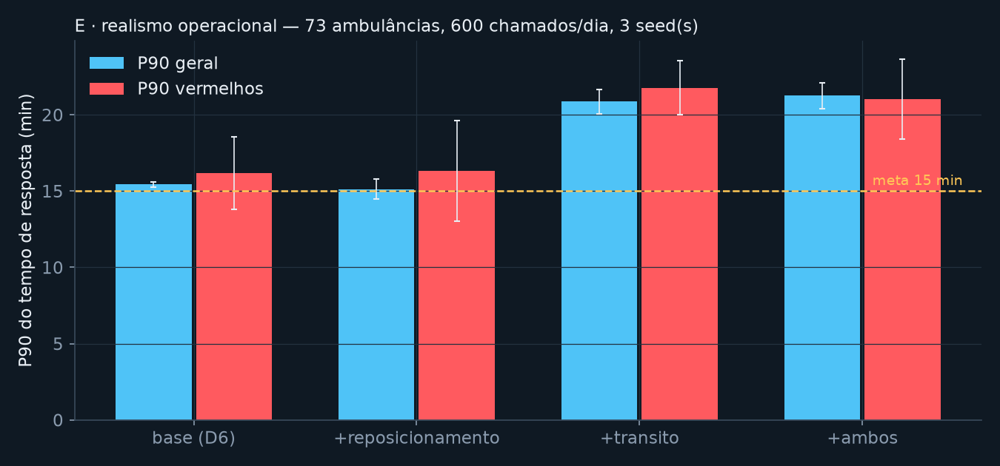
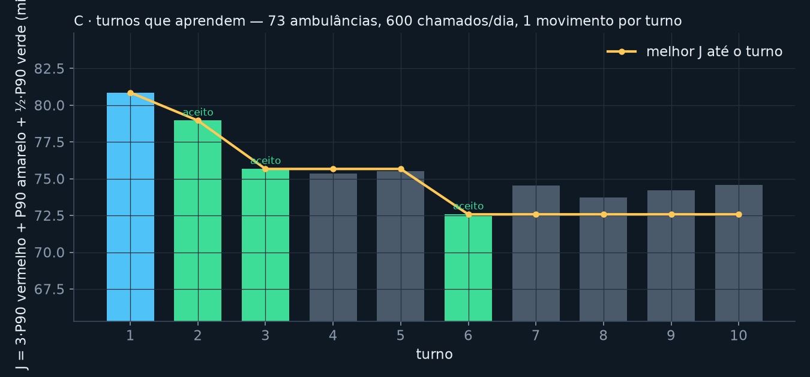
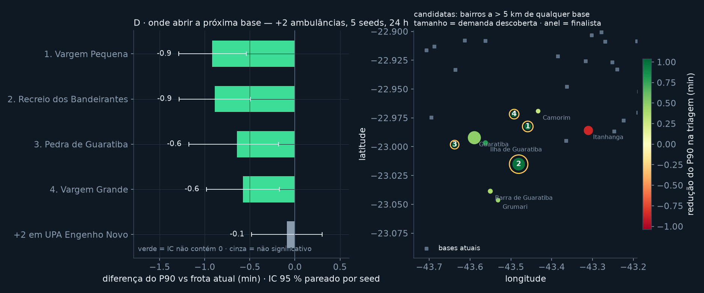

# samu-sim

Simulador **distribuído** de despacho de ambulâncias no Rio de Janeiro, construído como
ferramenta de apoio à decisão: *qual política de despacho reduz o tempo de resposta na Zona
Oeste?*, *a partir de quantas ambulâncias o ganho é marginal?* e *onde abrir a próxima base?* —
cada resposta com intervalo de confiança.

Chamados sintéticos (proporcionais à população por bairro, com picos de manhã e à noite) entram
numa fila **SQS**; N **despachantes** concorrentes escolhem a ambulância por uma política plugável e
disputam a reserva com **lock otimista** no **DynamoDB**; **workers** simulam o deslocamento pela
malha viária real (OSRM) em tempo acelerado; um **reaper** recupera ambulâncias de workers mortos;
uma **API** expõe métricas e um console ao vivo. Mesmo código roda em memória (1 processo), em
`docker compose` com LocalStack, e numa EC2 com SQS/DynamoDB/S3 reais via Terraform.

## Resultados




*24 h simuladas, 600 chamados/dia (≈ os 592/dia reais do SAMU-RJ), 3 seeds, 165 bairros do Censo
2022, 43 bases reais, tempos do OSRM, ciclo com transporte ao hospital. `scripts/experimentos.py` →
`docs/experimentos/resultados.json`; calibração e fontes em [`docs/calibracao.md`](docs/calibracao.md).*

| A · política (73 ambulâncias = frota real) | P50 | P90 | P90 Barra | P90 **Oeste** |
|---|---|---|---|---|
| `mais_proxima` (linha reta) | 7,5 min | 16,5 min | 22 | **16** |
| `menor_eta` (malha viária) | 7,6 min | 16,0 min | 22 | **12** |
| `menor_eta_cobertura` (não esvaziar base) | 8,9 min | 18,4 min | 24 | 15 |

| B · frota (`menor_eta`, com trânsito e reposicionamento) | 20 | 30 | 40 | 50 | **65** | 80 |
|---|---|---|---|---|---|---|
| P90 | 312 min | 335 | 210 | 102 | **23,2** | 20,0 |
| na fila ao fim do dia | 1005 | 653 | 382 | 68 | 0 | 0 |

*(sem trânsito, D6: 65 → 17,9 min e 80 → 15,0 min; o trânsito de pico custa ~5 min de P90 em qualquer frota)*

**Os insights:**

- **A frota real está no lugar certo — e a meta de 15 min não é atingível com ela.** Com o ciclo
  completo (deslocamento + 20–30 min no local + transporte ao hospital + entrega) e trânsito de pico,
  50 ambulâncias colapsam ao longo do dia e o joelho fica em ~65; o SAMU-RJ opera 73 — dentro da
  faixa estável, com P90 ≈ 21 min. Nem 80 ambulâncias batem 15 min no P90 com trânsito; sem trânsito,
  80 batem. Ou seja: o problema do P90 no Rio é mais via do que frota.
- **A política paga na Zona Oeste.** Despachar pela linha reta custa 4 min de P90 lá (16 → 12 com a
  malha viária), porque o Maciço da Pedra Branca e a baía de Sepetiba tornam a "mais próxima" enganosa;
  no resto da cidade a diferença some. Em regime saturado (50 ambulâncias) a diferença era de 40 → 17 min.
- **"Não esvaziar a base" piorou.** A política com penalidade de cobertura manda uma ambulância mais
  longe para preservar a base — e o custo de resposta supera o ganho de cobertura. Um resultado negativo
  útil: a intuição estava errada, e só a medição mostrou.

**Validação distribuída:** o mesmo cenário rodado na AWS — EC2 com 6 containers, SQS e DynamoDB
reais — reproduziu o modelo em memória com < 2 % de diferença (`scripts/experimento_aws.sh`).

## Realismo operacional (D8): o que cada correção do modelo mudou



Três correções, medidas uma a uma na frota real de 73 (3 seeds, 24 h):

| variante | P50 | P90 | P90 vermelhos |
|---|---|---|---|
| ambulância despachável ao liberar no hospital (sempre ligado) | 7,3 min | 15,4 min | 16,2 min |
| + reposicionamento por previsão de demanda | 7,4 | 15,1 | 16,3 |
| + trânsito por hora | 9,5 | 20,9 | 21,8 |
| + ambos | 10,0 | 21,3 | 21,0 |

- **Disponível ao liberar** (antes só voltava a ser despachável na base): P90 com 73 caiu de 16,0
  para 15,4 min e o joelho da frota deslocou-se para baixo. Era o maior erro do modelo — ambulância
  ociosa num hospital que fica exatamente onde a demanda está.
- **Reposicionamento** (a ambulância liberada vai para a base de maior demanda prevista nas próximas
  2 h relativa à cobertura, dentro de 8 km, e só se a pressão for ≥ 1,5× a da base atual): efeito
  **neutro** (−0,3 min, dentro do ruído). A primeira versão, sem limiar e com raio de 15 km, *piorava*
  1,3 min: o custo do deslocamento superava o ganho. Com 43 bases já bem distribuídas, sobra pouco
  para reposicionar — o modelo de demanda é honesto (treinado só com `chamado_criado`, aprende os picos
  de 12 h/19 h por zona), mas a decisão que ele alimenta não move o ponteiro aqui.
- **Trânsito** (fator por hora sobre o tempo de via livre do OSRM, ≈ +50 % nos picos): +5,5 min de
  P90. É a correção que mais muda a conclusão: com trânsito, a meta de 15 min fica fora de alcance
  para qualquer frota testada.

## Prioridade e turnos que aprendem (D7)



**Prioridade.** Cada chamado nasce com a classificação do regulador (vermelho 10 % / amarelo 30 % /
verde 60 %). São três filas SQS; o despachante só desce de nível quando a fila acima está vazia,
e o reaper devolve o chamado à fila da sua prioridade. A métrica que importa passa a ser o
**P90 dos vermelhos**, e o objetivo dos experimentos é `J = 3·P90(vermelho) + P90(amarelo) + ½·P90(verde)`.

**Turnos.** `scripts/turnos.py` roda o dia simulado repetidamente. A cada turno o otimizador lê o
resultado e escreve o diagnóstico em linguagem simples — *"Zona Barra tem o pior resultado: P90 21 min;
UPA Paciência está ociosa 98 % do tempo com 2 ambulâncias; mover 1 ambulância de UPA Paciência para
UPA Jacarepaguá (cobre 607 mil hab. num raio de 5 km)"* — aplica o movimento, mede, e **mantém se J
caiu ≥ 2 %, desfaz se não** (hill-climbing com memória do que já tentou). Resultado em 10 turnos com a
frota real de 73: **J 80,9 → 72,6 (−10 %)**, P90 global 16,4 → 14,2 min, P90 dos vermelhos 19,0 → 17,2
min, com 3 movimentos aceitos (Paciência e Vila Kennedy → UPA Jacarepaguá; Evandro Freire → Lourenço
Jorge) e 6 rejeitados. A Barra continua a zona pior servida (4 bases para 460 mil hab.) — o próximo
ganho é uma base nova, não realocação.

A alocação vencedora fica em `dados/alocacao.json` e o bootstrap a usa na AWS; o console mostra a
trajetória (`GET /turnos`).

**Isto é aprendizado de máquina?** Não, e o README diz isso de propósito: é *otimização guiada por
dados* — cada decisão tem uma justificativa que dá para narrar e auditar. Onde ML entraria de verdade:
(1) previsão de demanda por zona × hora sobre o event log, para reposicionar ambulâncias livres ao
longo do dia (com dados sintéticos o modelo só aprenderia a curva que eu mesmo escrevi; o valor é o
pipeline, que com a série real do SAMU-RJ aprenderia padrões reais); (2) triagem automática a partir
da ligação — exige dados reais de chamadas. Aprender a política de despacho com RL seria a versão
vistosa e a que eu não faria: caro de treinar num simulador em tempo real acelerado e impossível de
defender em 35 minutos.

## Onde abrir a próxima base (D9 — experimento D)



O otimizador de turnos (D7) mostrou que **realocar** a frota não resolve a Barra (P90 ≈ 19 min com a
alocação otimizada). A pergunta seguinte é a que a prefeitura faz de verdade: *com orçamento para
2 ambulâncias, vale mais abrir uma base nova ou reforçar uma existente — e onde?*

Método, em dois estágios pra caber em 30 min de máquina:

1. **Heurística barata**: candidatas = centróides dos bairros a mais de 5 km de qualquer base, ordenados
   pela demanda populacional descoberta (`samu_sim/expansao.py`). Dá 10 candidatas — todas na Barra
   e na Zona Oeste (Guaratiba, Recreio, Itanhangá, Vargens…).
2. **Triagem** (1 seed, 12 h) de cada candidata com +2 ambulâncias na base nova, e **final** (5 seeds,
   24 h) das 4 melhores contra dois cenários com as mesmas seeds: a **frota atual** (73, alocação
   otimizada) e um **controle** — as mesmas +2 ambulâncias na base existente mais pressionada
   (UPA Engenho Novo). Sem o controle, o ganho seria confundido com "mais frota".

| cenário (+2 ambulâncias) | P90 geral | P90 Barra | Δ P90 vs frota atual [IC 95 %] | Δ vs controle |
|---|---|---|---|---|
| frota atual (73) | 14,1 | 19,2 | — | — |
| +2 em UPA Engenho Novo (controle) | 14,1 | 19,4 | −0,1 [−0,5, +0,3] n.s. | — |
| **base nova em Vargem Pequena** | **13,2** | **17,3** | **−0,9 [−1,3, −0,5]** | −0,8 [−1,1, −0,6] |
| base nova no Recreio | 13,3 | 17,3 | −0,9 [−1,3, −0,5] | −0,8 [−0,9, −0,7] |
| base nova em Pedra de Guaratiba | 13,5 | 19,3 | −0,6 [−1,2, −0,2] | −0,6 (Oeste −1,1, Barra 0) |
| base nova em Vargem Grande | 13,6 | 17,4 | −0,6 [−1,0, −0,2] | −0,5 [−0,7, −0,3] |

Leitura:

- **Reforçar uma base existente não muda nada** (−0,1 min, IC contém zero). O sistema já está na
  faixa estável (experimento B): ambulância extra onde já há cobertura vira ociosidade.
- **Uma base nova nas Vargens/Recreio reduz o P90 da cidade em ~0,9 min e o da Barra em ~2 min**
  (19,2 → 17,3), com IC que exclui zero mesmo com 5 seeds — porque a comparação é pareada por seed.
- Pedra de Guaratiba ajuda a Zona Oeste (−1,1) e não a Barra: candidatas diferentes atacam zonas
  diferentes; a escolha depende de qual zona a Secretaria quer priorizar.
- Nenhuma delas leva a Barra à meta de 15 min: é o mesmo veredito do D8 — **mais via do que frota**.

Reproduzir: `python scripts/experimento_d.py` (≈ 28 min; `--rapido` em 5 min) → `docs/experimentos/expansao.json`,
`python scripts/graficos.py`. O console mostra as finalistas na seção "Onde abrir a próxima base" e
as candidatas no mapa.

## Cenários com intervalo de confiança (D9)

Até o D8 cada comparação era "média de 3 seeds". Um gestor precisa de *"abrir uma base no Recreio
reduz o P90 em 2,0 ± 0,3 min"* — senão não dá pra distinguir efeito de ruído. O D9 transforma
isso em instrumento:

- `samu_sim/estatistica.py` — IC 95 % por **bootstrap** (Python puro, determinístico) e
  **diferença pareada por seed**: os dois cenários rodam com as *mesmas* seeds (common random
  numbers), então a variância do gerador de chamados cancela e o IC da diferença fica muito mais
  estreito do que comparar duas médias independentes. "Significativo" = IC da diferença não contém 0
  (exige ≥ 3 seeds).
- `samu_sim/cenarios.py` — um `Cenario` descreve frota, política, alocação por base, bases extras,
  trânsito e reposicionamento; `executar` roda N seeds e resume com IC; `comparar` faz a diferença
  pareada por métrica (P90, P50, P90 vermelhos, pendentes, P90 por zona).
- API: `POST /cenarios` enfileira um job (uma simulação em memória por vez, numa thread da API),
  `GET /cenarios/{id}` devolve o resultado, `GET /cenarios/{a}/comparar/{b}` a diferença pareada.
  O console tem a seção **"E se…?"**: escolhe frota/política/seeds/duração, submete e seleciona dois
  cenários concluídos pra ver a diferença com IC.
- CLI: `python scripts/cenarios.py --base '{"nome":"73"}' --alt '{"nome":"80","n_ambulancias":80}'`.
- Armadilha medida: o relógio acelerado precisa de CPU. Na t3.micro, o mesmo cenário a fator 3000 deu
  P90 44 min onde o correto (local, ou fator 500) é 19 — o processamento fica pra trás do relógio e os
  tempos saem inflados. Por isso `CENARIOS_FATOR_MAX` (500 na AWS): um job de 5 seeds × 24 h leva ~15 min lá.

## Decisões de arquitetura (e o que mudou)

| Decisão | Por quê | O que aprendi |
|---|---|---|
| Tempo real acelerado (fator 1–200) em vez de simulação a eventos discretos | os problemas de concorrência têm que existir de verdade | o relógio distribuído é a parte mais traiçoeira: wall-clock salta (VM), então cada serviço sincroniza uma vez e avança com `monotonic` |
| SQS + DynamoDB desde o dia 1 (LocalStack) | um só código local e na AWS | SQS *standard* é at-least-once e sem ordem: idempotência por chamado + máquina de estados com versão resolveram |
| Lock otimista (`ConditionExpression` em `status` e `versao`) | N despachantes disputam a mesma ambulância | corridas perdidas são contadas (`reserva_falhou`), nunca escondidas |
| Heartbeat + reaper em vez de lease/lock distribuído | simples e observável | o reaper expôs 2 bugs (heartbeat na reserva; mensagem antiga após reatribuição) |
| Roteador com 3 implementações (haversine → OSRM → matriz) | funcionar no dia 1, medir depois | a reta subestima o P90 da Zona Oeste em 22%; `/table` em lote resolveu o gargalo de 40 `/route` por despacho |
| Métricas a partir do event log JSONL | uma fonte de verdade; vira dataset | o mesmo log alimenta o feed do console, o `analisar_rodada.py` e os experimentos |
| EC2 t3.micro + compose (não Fargate) | custo zero | o build na instância atrasa o gerador ~30 min sim: chamados "do passado" precisam ser descartados |

## O que eu faria diferente / próximos passos

- **Relógio lógico** (ticks) em vez de tempo real acelerado: reprodutibilidade exata e rodadas
  em segundos; custa uma barreira de sincronização entre serviços.
- **Fargate + ALB** no lugar da EC2 única; **WebSocket + React** no lugar do polling.
- **Trânsito real** (COR/Waze por corredor e hora) no lugar do perfil estimado — é a variável que
  mais muda a conclusão, e a menos calibrada.
- **Reposicionamento com objetivo explícito** (cobertura garantida por zona, não pressão relativa) —
  a versão atual é neutra; agora dá pra avaliar a próxima com `scripts/cenarios.py` antes de ajustar.
- **Preempção**: desviar uma ambulância a caminho de um verde para um vermelho a 2 min — cancelar um
  ciclo em voo em outro processo é o melhor problema distribuído que sobrou.
- **Replay** do event log (reconstruir o estado em qualquer instante) e **frota heterogênea**
  (USA/USB/motolância, troca de plantão) — os dois mudam o que a política pode decidir.

---

Spec: `docs/superpowers/specs/2026-09-18-samu-sim-design.md` · planos por dia em `docs/superpowers/plans/`.

## Rodar (D1 — tudo em memória)

```bash
py -3.12 -m venv .venv
.venv/Scripts/python -m pip install -e ".[dev]"
.venv/Scripts/python -m pytest -q
.venv/Scripts/python -m samu_sim.local --fator 20 --duracao-sim 3600 --ambulancias 50 --politica mais_proxima
```

`--fator` acelera o tempo (1 s real = `fator` s simulados). `--log-dir logs` grava o event log JSONL.

## Rodar em containers (D2 — SQS + DynamoDB via LocalStack)

```bash
FATOR=60 docker compose up --build -d      # localstack, bootstrap, gerador, 2 despachantes, 2 workers, api
curl localhost:8000/metricas               # P50/P90 ao vivo + tamanho da fila
curl -X POST localhost:8000/controle -H 'content-type: application/json' -d '{"fator": 200}'
curl -X POST localhost:8000/controle -H 'content-type: application/json' -d '{"pausada": true}'
python scripts/analisar_rodada.py logs/local   # métricas a partir do event log
docker compose down -v
```

Variáveis: `FATOR`, `POLITICA`, `N_AMBULANCIAS`, `CHAMADOS_POR_DIA`, `SEED`, `RODADA_ID`.
O relógio simulado é compartilhado pela tabela `rodada` (checkpoint `inicio_real/inicio_sim/fator`);
cada serviço relê a cada 10 s, então `POST /controle` muda o fator em todos sem saltar o tempo.

### Testes de caos

| Falha | Como provocar | O que observar |
|---|---|---|
| Worker morre | `docker compose kill ambulancia-w1` | após ~2–3 min, `reaper_liberou` em `logs/local/api.jsonl`; chamado volta pra fila |
| Despachante morre com msg em mãos | `docker compose kill despachante && docker compose start despachante` | `chamado_ja_despachado` nos logs; `analisar_rodada.py` sem `despachos_duplicados` |
| Corrida entre despachantes | 2 réplicas + `FATOR=200` | `reserva_falhou` > 0 nos logs, nunca 2 `despachada` pro mesmo chamado |

O `bootstrap` é idempotente: se já existe uma rodada ele não mexe em nada (`docker compose start`
re-executa one-shots). Para recomeçar: `docker compose down -v` ou `RESET=1`.

### O que os testes de caos encontraram (e como foi corrigido)

| Sintoma | Causa | Correção |
|---|---|---|
| Tempos de resposta **negativos** | o clock da VM do Docker Desktop saltou −236 s e todos os serviços derivavam o tempo simulado do `time.time()` | `Relogio` sincroniza uma vez com o wall-clock e depois avança com `time.monotonic()`; um salto só afeta quem re-sincronizar |
| Reaper liberava ambulância **30 s** após reserva (timeout é 120 s) | reserva não gravava `heartbeat_em` (ficava 0) | despachante grava heartbeat na reserva |
| Worker reiniciado executava o ciclo do **chamado errado** | mensagem antiga na fila do worker passava na máquina de estados depois do reaper reatribuir a ambulância | worker exige `ambulancia.chamado_id == msg.chamado_id` |
| `ConflitoVersao` em massa + `ResourceNotFound` | `docker compose start` re-executava o bootstrap, que apagava as tabelas no meio da rodada | bootstrap idempotente (`RESET=1` para forçar) |

### Testes de integração (exigem LocalStack)

```bash
docker compose up -d localstack
AWS_ENDPOINT_URL=http://localhost:4566 AWS_ACCESS_KEY_ID=test AWS_SECRET_ACCESS_KEY=test python -m pytest -q -m integration
```

## Roteamento (D3 — OSRM na malha viária real do Rio)

Três implementações da mesma interface `Roteador.eta(origem, destino)`:

| Roteador | Como | Quando usar |
|---|---|---|
| `haversine` | linha reta a 30 km/h | dia 1, testes, fallback |
| `osrm` | HTTP no OSRM (malha OSM do Rio), timeout 2 s → fallback haversine, evento `roteador_fallback` | local, com `--profile osrm` |
| `matriz` | lookup em `dados/matriz_eta.json` (bases × centróides de bairro, gerado pelo OSRM `table`) + trecho de aproximação | AWS t3.micro (sem container de 1 GB); pontos a > 1,5 km de um centróide caem em haversine |

```bash
bash scripts/preparar_osrm.sh                      # uma vez: extrato BBBike do Rio (36 MB) + osrm-extract/partition/customize (~2 min)
docker compose --profile osrm up -d osrm
python scripts/gerar_matriz_osrm.py                # regenera dados/matriz_eta.json
ROTEADOR=osrm docker compose --profile osrm up -d  # stack inteira roteando pelo OSRM
python scripts/comparar_roteadores.py --fator 3000 --duracao-sim 43200 --ambulancias 50 --chamados-por-dia 400
```

### Haversine × OSRM × matriz (mesma seed, 12 h simuladas, 50 ambulâncias, 400 chamados/dia)

| roteador | P50 | P90 | P90 Barra | P90 Norte | P90 **Oeste** | P90 Sul |
|---|---|---|---|---|---|---|
| haversine | 8,5 min | 15,5 min | 24 | 12 | **27** | 12 |
| osrm | 9,1 min | 17,6 min | 21 | 12 | **33** | 14 |
| matriz | 10,2 min | 18,5 min | 23 | 13 | **33** | 13 |

A linha reta subestima o P90 global em ~14% e o da Zona Oeste em **22%** — é onde a malha
(Av. Brasil, Santa Cruz, Guaratiba) mais diverge da reta. A matriz reproduz o OSRM a ~5%,
o que valida usá-la na AWS.

**Gargalo medido:** `menor_eta` avalia todas as candidatas; 40 chamadas `/route` = 210 ms
reais = 17 min *simulados* a fator 5000 (a primeira comparação saiu com P50 de 128 min por
isso). Solução: `Roteador.etas_de(origens, destino)` em lote — 1 chamada `/table` = 34 ms.

## AWS (D4 — EC2 + SQS + DynamoDB + S3 via Terraform)

Mesmo código, sem LocalStack: `docker-compose.aws.yml` numa **EC2 t3.micro** falando com
SQS, DynamoDB e S3 reais pelo *instance profile* (nenhuma credencial na máquina). Tudo criado
por Terraform em `infra/` (15 recursos): filas, tabelas on-demand, bucket de logs, role/perfil
IAM com permissão só nesses recursos, security group com 22 e 8000 abertos só para o seu IP,
e a instância com *user-data* que instala Docker, clona o repo e sobe o compose.

```bash
aws configure                              # usuario IAM proprio; regiao us-east-1
cp infra/terraform.tfvars.example infra/terraform.tfvars   # seu IP /32, chave ssh publica, repo
bash scripts/deploy.sh                     # apply + espera a API (~4 min)
bash scripts/atualizar_ec2.sh              # git pull + rebuild na instancia (RESET=1 zera a rodada)
bash scripts/coletar_logs_ec2.sh           # event log -> S3 -> logs/
terraform -chdir=infra destroy -auto-approve   # no fim da sessao
```

Custo: t3.micro ≈ US$ 0,01/h; SQS/DynamoDB/S3 dentro do free tier permanente. Dois orçamentos
(gasto zero e US$ 10/mês) alertam por e-mail.

O que o deploy real encontrou: o build da imagem atrasa o gerador ~30 min simulados em relação
ao checkpoint do bootstrap, e chamados "do passado" saíam com espera fictícia (P90 de 51 min);
o gerador agora descarta chamados já vencidos ao iniciar (`chamados_pulados`).

## Console ao vivo

`GET /` serve o console: relógio simulado, P50/P90 por zona contra a meta de 15 min, frota por
estado, fila, controle de velocidade/pausa, mapa com ambulâncias se movendo (posição interpolada
entre base e chamado por `despachado_em`/`chegada_prevista_em`), feed de eventos de todos os
serviços (`GET /eventos` lê os JSONL da rodada) e **modo seguir**: clique num chamado ou em
"Seguir o próximo chamado" para acompanhar a linha do tempo dele (aberto → despachada → a
caminho → no local → concluído) com a câmera enquadrando. Estado também por WebSocket em
`/ws/estado`. Sem Docker: `python scripts/dev_api.py` roda tudo em memória num processo.

## Estado

- [x] D1: núcleo em memória (relógio, fila, repositório com lock otimista, políticas, serviços, métricas)
- [x] D2: docker compose + LocalStack (SQS/DynamoDB), reaper, análise de rodada
- [x] D3: OSRM + política `menor_eta` real + matriz pré-computada
- [x] D4: Terraform + EC2 + mapa (console ao vivo, modo seguir)
- [x] D5: experimentos A (políticas) e B (frota), validação na AWS, gráficos
- [x] D6: dados reais (Censo 2022, hospitais/UPAs, estatísticas do SAMU-RJ), gravidade, ciclo com hospital
- [x] D7: filas por prioridade, otimizador de turnos (alocação por base), console de turnos
- [x] D8: despachável ao liberar, previsão de demanda + reposicionamento, trânsito por hora (ablação medida)
- [x] D9: cenários com IC (bootstrap, diferença pareada por seed, `POST /cenarios`), experimento D (onde abrir a próxima base)
